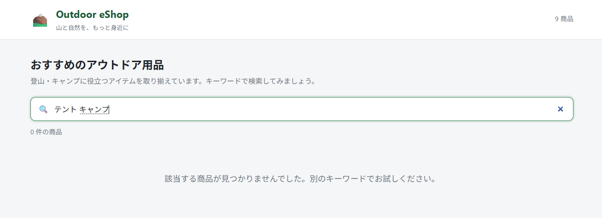

# Lab 03: 運用バグを Cloud Agent へ委託する

**テーマ:** 運用チームから上がった Issue を、Cloud Agent に修正を委託する

## シナリオ

リリース後、利用者から「複数キーワードで検索すると 0 件になる」という報告が届いた。
`キャンプ テント` のようにスペース区切りで検索すると、商品名に両方の語が含まれていても
ヒットしない。このバグに関して Issue を立ち上げ、GitHub Copilot App から Cloud Agent へ委託する。

これまでの Lab では GitHub Copilot App (ローカル) で GitHub Native なローカルエージェントの活用を体験したが、本ラボでは Issue 起点でのバグ修正を Cloud Agent に委任する流れを体験する。

## 前提条件

- Lab 02 で `main` に変更がマージされていること。
- リポジトリで GitHub Issues と Copilot Cloud Agent が利用できること。
- フォークリポジトリに Issues 機能が追加されていること。
  1. フォークしたリポジトリで **[Setting]** を開く。
  2. [Features] の **Issues** チェックボックスから有効にする。

## 手順

### 1. ローカル main に前回の変更を反映させ、その後バグを確認する

1. GitHub Copilot App で該当プロジェクトから **[New Session]** を開き、**Local repository** を選択して、`git status` を実行する。
2. 先程 Lab 02 で PR 経由でマージした変更をローカルの main に反映させるために、右上の **Pull** を押す。
3. **Run** を実行してアプリケーションを起動し、**Browser Canvas** で商品詳細ページが機能が反映されているか確認する。
4. **バグの確認** : 検索ボックスに `キャンプ テント`（半角スペース）と入力し、0 件になることを確認する。



### 2. Issue を作成する

左サイドバーから **[My work]** を開き、右上のリポジトリフィルターで `<user-account>/github-copilot-ai-ready-workshop` を選択する。


右上の **New issue** から Copilot をアサインした Issue を挙げる。

- **Repository** : `<user-account>/github-copilot-ai-ready-workshop`
- **Add a title** : [Bug] 複数キーワード検索ができない
- **Add a description** : [以降のテキストをコピペ]
- **Assignee** : Copilot

```text
## 概要
複数キーワードをスペース区切りで検索すると 0 件になる
 
## 再現手順
検索ボックスに「キャンプ テント」と入力する
 
## 実際の結果
該当商品があるのに 0 件になる
 
## 期待する結果
すべてのキーワードを含む商品が表示される
 
## 受け入れ条件
 
- [ ] 半角・全角スペース区切りの複数キーワードを AND 条件で扱う
- [ ] 連続スペースと前後スペースを無視する
- [ ] 空検索・単一キーワードの既存動作を維持する
- [ ] 元の商品配列を変更しない
- [ ] src/lib/search.test.ts に再現ケースと回帰テストを追加する
```

Issue を挙げてしばらくすると Copilot が自動で PR Draft を作成する。**[My work]** ページの **[Active]** タブから内容を確認できる。

### 2. 実装の完了を待つ

PR Draft が作成され、Cloud Agent が実装を開始する。

Wen UI から対象の PR Draft を開き、**View session** を押すことで、実装・テストの様子が確認できる。

実装が完了すると通知が飛び、レビューを委任される。

- GitHub Copilot App UI
  
- Web UI
  

> [!Note]
> Cloud Agent は実装を完了すると初回に作成した PR Draft を書き換え、変更点を示した内容にアップデートする。

## 本ラボで期待する結果

- Issue を挙げると Copilot (Cloud Agent) がアサインされる。
- Cloud Agent が新しいブランチを切り、PR 作成から実装・テストまで一気通貫で作業する。
- 実装完了後、PR が変更点を踏まえた内容にアップデートされる。

---

← [Lab 02](./02-feature-pr.md) ・ 次へ → [Lab 04: Cloud Agent の PR をレビューする](./04-review-cloud-agent-pr.md)
